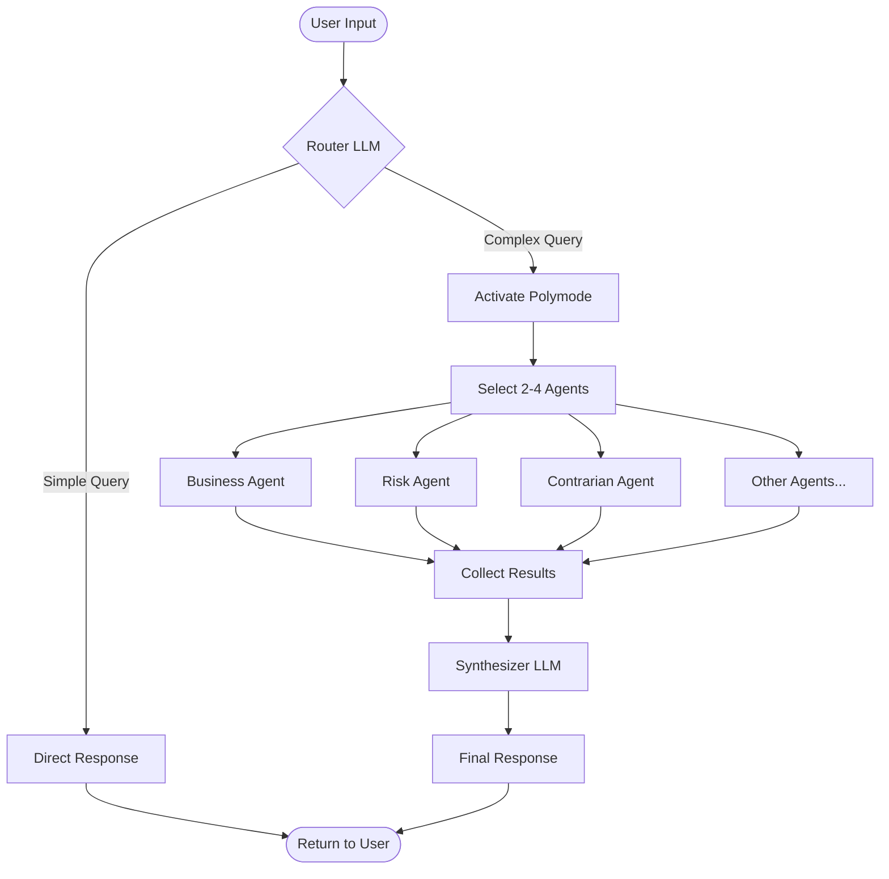
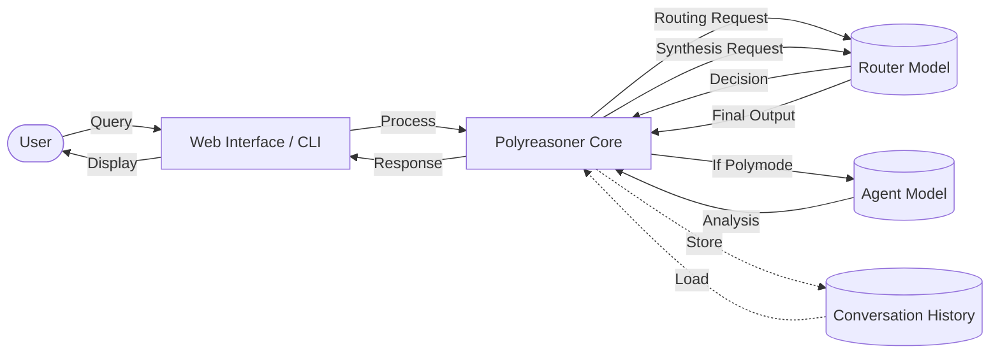

# Polyreasoner - Workflow & Data Flow

## System Workflow



## Data Flow Diagram (DFD)



## Step-by-Step Process

### 1. User Input
- User sends a question via web interface or CLI
- Input is captured and sent to Polyreasoner core

### 2. Router Decision
- **Router LLM** analyzes the query
- Decides: Simple or Complex?
  - **Simple** → Direct answer
  - **Complex** → Activate polymode

### 3. Polymode Activation (Complex Queries Only)
- Router selects 2-4 specialized agents
- Agents chosen based on query type:
  - Business decisions → business, risk, contrarian
  - Technical choices → feasibility, security, impact
  - Ethical questions → ethical, impact, contrarian

### 4. Agent Execution
- Each agent runs **sequentially** (one at a time)
- Agent receives:
  - Original query
  - Agent-specific prompt
  - Optional context
- Agent returns:
  - JSON structured analysis
  - Verdict, confidence, recommendations

### 5. Synthesis
- **Synthesizer** (Router LLM) combines all agent outputs
- Creates structured response with:
  - Agreements between agents
  - Conflicts and trade-offs
  - Critical risks
  - Questions for user

### 6. Response Delivery
- Final response sent back to user
- Conversation history updated
- User can continue the conversation

## Data Storage

| Data | Storage | Purpose |
|------|---------|---------|
| **Conversation History** | In-memory list | Context for follow-up questions (last 5 exchanges) |
| **Models** | Disk (GGUF files) | LLM inference |
| **Prompts** | Code (prompts.py) | Agent instructions |
| **Config** | Code (config.py) | Model paths, settings |

## Key Design Choices

### Why Sequential Agents?
- `llama-cpp` can't handle parallel access to same model
- Sequential execution is simple and reliable
- Limited to 3 agents max for speed

### Why Same Model for Router & Agents?
- Avoids model swapping (saves VRAM)
- Faster execution
- Simpler architecture

### Why No Database?
- Lightweight system
- In-memory history sufficient
- No need for persistence

## Example Flow

**Input:** "Should I open source my ML project?"

```
1. Router → Detects complex decision → Activates polymode
2. Selects: business, risk, contrarian agents
3. Business → Analyzes market opportunities and barriers
4. Risk → Identifies threats and failure modes
5. Contrarian → Argues against open sourcing
6. Synthesizer → Combines perspectives into trade-offs
7. Output → Structured analysis with questions for user
```

**Time:** ~30-60 seconds (3 agents × ~10-20s each)
